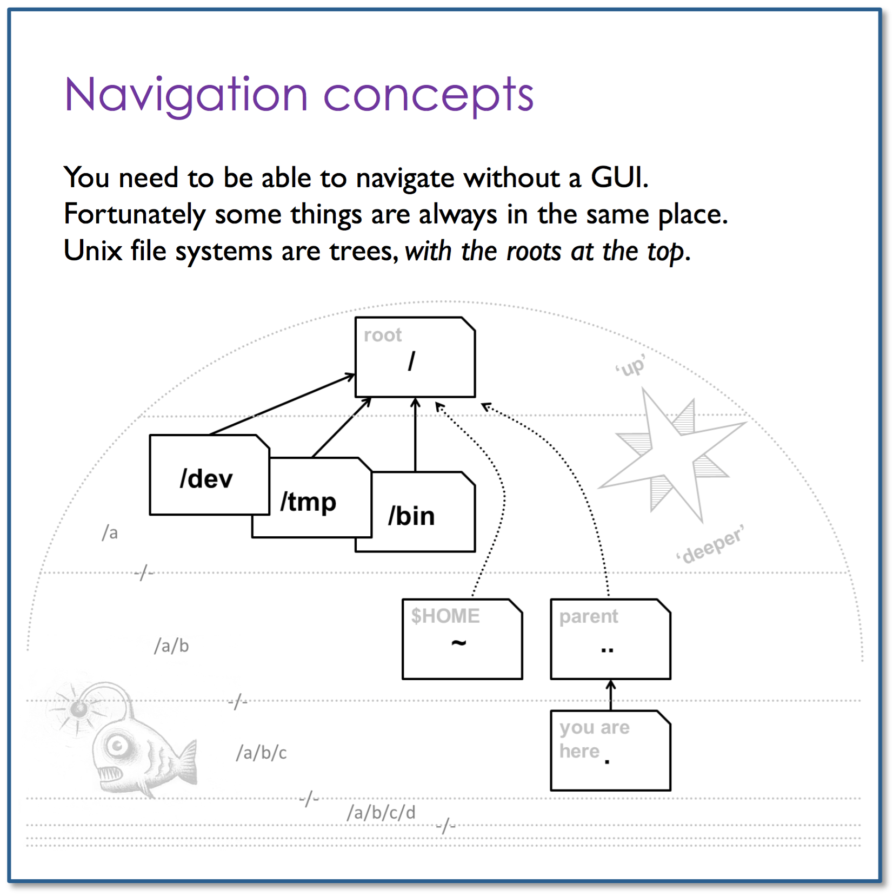
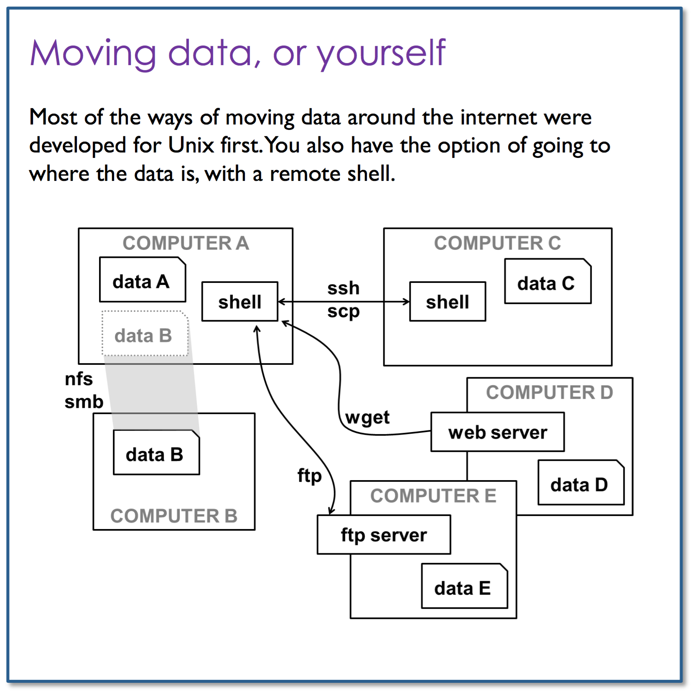

# Session 1: Shell

## Learning Objectives

- Use most useful shell commands
- Organise data into folders
- Log in onto the cluster
- Understand directories' structure
- Viewing reference genomes
- Retrieve sequencing data
- Concatenate datasets

## Basics, most useful shell commands

Open a Terminal window:


### Syntax

Remember the UNIX/LINUX command line is **case sensitive**!

- `$` indicates start of command
- `#` indicates end of command and start of comment

The `$` and `#` symbols are not part of the command.

`<...>` or `my_...` refers to variables and file names that need to be specified by the user. The arrows `<...>` need to be excluded, because they are generic UNIX redirection functions!

### Orientation

```shell
$ whoami   # shows as who you are logged in
$ hostname # shows on which machine you are
$ pwd      # present working directory

$ ls       # list directory contents of pwd
$ ls -l    # provides additional info on files and directories
$ ls -la   # includes hidden files (.name) as well
$ ls -lat  # lists files in chronological order
$ ls -R    # lists subdirectories recursively
$ man ls   # manual on command ls

$ cd <dir_name> # changes/switches into specified directory
$ cd ..         # moves one directory up
$ cd ../../     # moves two directories up (and so on)
$ cd            # brings you to highest level of your home directory
```

> :computer: **EXERCISE** [Download Session 1 data ](https://github.com/bioinformatics-core-shared-training/crukci-cluster-transition/raw/master/session1-data.zip), save file onto your computer and unzip it.
>
> Open a Terminal window, navigate to the downloaded file and enter into its contents, and go to `nelle` directory. Draw a diagram of `nelle`'s directories and files structure. Do not use a graphical interface, only the command line please!
>
> :tada: Congratulations! :thumbsup: You did it! :wink:  

> See [images/homedir.png](images/homedir.png) for the answer


### Files and directories

```shell
$ mkdir <dir_name> # creates specified directory
$ rmdir <dir_name> # removes empty directory

$ nano <file_name> # create a file using the text editor nano

$ rm <file_name>   # removes file name
$ rm -r <dir_name> # removes directory including its content, but asks for confirmation, 'f' argument turns confirmation off

$ mv <name1> <name2> # renames directories or files
$ mv <name> <path>   # moves file/directory as specified in path

$ cp <name> <path>   # copy file/directory as specified in path (-r to include content in directories)
```

When we say, "nano is a text editor", we really do mean "text": it can only work with **plain character data**, not tables, images, or any other human-friendly media. We use it in examples because almost anyone can drive it anywhere without training, but please use something more powerful for real work. On Unix systems (such as Linux and Mac OS X), many programmers use [Emacs](http://www.gnu.org/software/emacs/) or [Vim](http://www.vim.org/) (both of which are completely unintuitive, even by Unix standards), or a graphical editor such as [Atom](https://atom.io/) which is not available from the cluster.

> :computer: **EXERCISE** Go back to your Terminal window, or open a new one and navigate to `session1-data/nelle`
>
> - Create a new directory `thesis` and create a file `draft.txt` in it. Type this line `It's not "publish or perish" any more, it's "share and thrive"!` if you wish and save.
> - Navigate back to `session1-data/nelle` and delete `thesis` directory.
> - Let's create that directory and file one more time.
> - `draft.txt` isn't a particularly informative name, so let's change it to `quotes.txt`
> - Let's now move `quotes.txt` into `nelle` directory
> - Copy `quotes.txt` into `thesis` directory as `quotations.txt` file
>
> :tada: Congratulations! :thumbsup: You did it! :wink:  

:warning: With Great Power Comes Great Responsibility. When the files and directories are deleted, there is no way back. They are totally gone forever.

### Copy and paste

Depends on local environment. Usually one of the following methods works:

- Copy: Ctrl&Shift&c or right/middle mouse click
- Paste: Ctrl&Shift&p or right/middle mouse click

### Handy shortcuts

```shell
$ ~/                              # refers to user's home directory
$ history                         # shows all commands you have used recently
$ !<number>                       # starts an old command by providing its ID number
$ up(down) key                    # scrolls through command history
$ <incomplete path/file_name> TAB # completes path/file_name
$ <incomplete command> SHIFT&TAB  # completes command
$ Ctrl a                          # cursor to beginning of command line
$ Ctrl e                          # cursor to end of command line
```

### Filters and pipes

Now that we know a few basic commands, we can finally look at the shell's most powerful feature: the ease with which it lets us combine existing programs in new ways. We'll start with a directory called `molecules` that contains six files describing some simple organic molecules. The `.pdb` extension indicates that these files are in Protein Data Bank format, a simple text format that specifies the type and position of each atom in the molecule. Which of these files is the shortest?

```shell
$ wc -l <file_name> # calculate the number of lines in each input file
$ ls *.txt          # list files with name matching zero or more characters and with .txt extension
```

## Folder structures



## Connecting to Cluster

### Moving data, or yourself




You first need a cluster account, request one via Helpdesk - IT <ithelpdesk@cruk.cam.ac.uk>.

```shell
ssh clust1-headnode.cri.camres.org
```

## Cluster directories' structure

- Home directory: `/home/$username`
- Shared installed software: `/home/bioinformatics/software`
- Scratch/working areas: `/mnt/scratcha` and `/mnt/scratchb`
- Reference data: `/mnt/scratchb/bioinformatics/reference_data`

The two scratch/working areas are separate but equivalent. These areas are (deliberately) not backed, they are a massively parallel distributed file system
called Lustre. Pick one to do your work, and to make best use vary which one to use.

Large files may need to be stripped to improve performance or files that many jobs reads. See `lfs setstripe --help` for help.

Limit number of files in directory, if possible avoid 10,000s files in single directory.

## Reference genomes

- Path to reference genomes: `/scratchb/bioinformatics/reference_data/reference_genomes/`
- Path to assembly: `/scratchb/bioinformatics/reference_data/reference_genomes/$organism/$assembly` e.g. for Human GRCh38 `/scratchb/bioinformatics/reference_data/reference_genomes/homo_sapiens/GRCh38`

What Bioinformatics Core maintains:
- Genome sequence (fasta)
- Alignment indices: BWA, TopHat, Bowtie (1, 2)
- Annotations:
  - GTF format gene model
  - RefFlat format gene model
  - Signal artifact list (if available)

## Getting sequencing data

### Using CRUKCI infrastructure

The Bioinformatics Core provides a tool for downloading files for projects, libraries and runs that you can use from the command line or integrate into your Java application. This is available internally from:
http://intranet.cri.camres.org/core-facilities/bioinformatics/sequencing/api

Save [this file](http://internal-bioinformatics.cruk.cam.ac.uk/software/clarity-tools.jar) to your working area. You can run the tool from the command line with:

```shell
wget http://internal-bioinformatics.cruk.cam.ac.uk/software/clarity-tools.jar
java -jar clarity-tools.jar --help
```

Usage example: `java -jar clarity-tools.jar -l SLX-14572`

### Getting files into and out of the cluster

Use SSH scp (SCoPy) to transfer data
```shell
scp -r data/ clust1-headnode:/scratchb/xxlab/
```

Bulk transfers using rsync (delta-transfer algorithm)
```shell
rsync -av data/ clust1-headnode:/scratchb/xxlab/data
```

## Concatenate datasets


## Take home message
